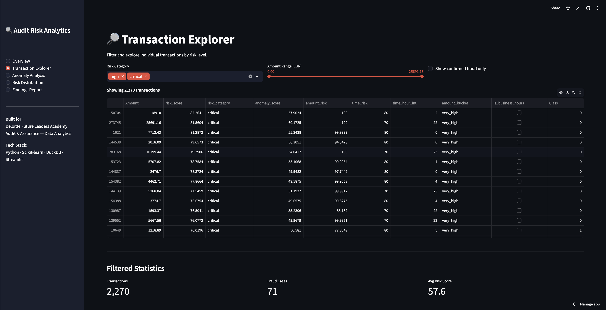
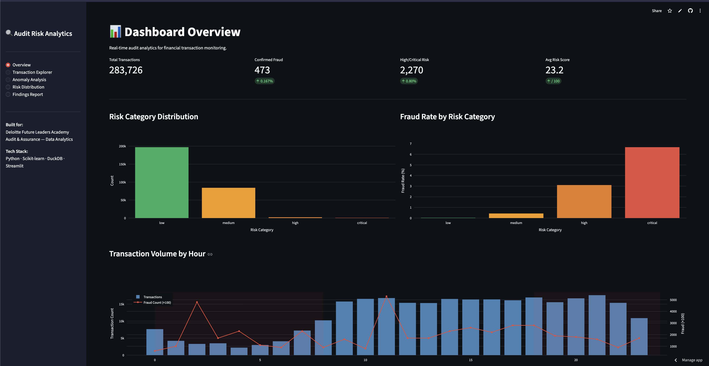
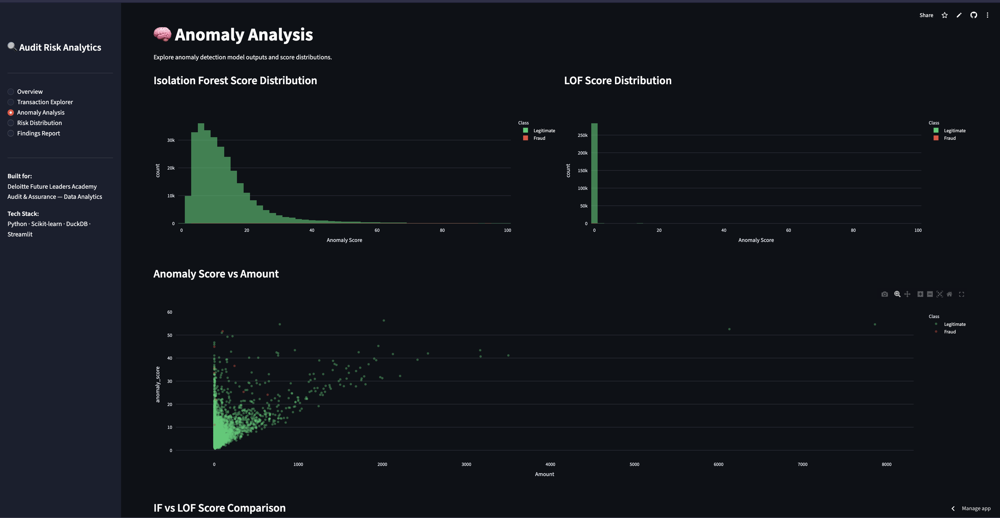
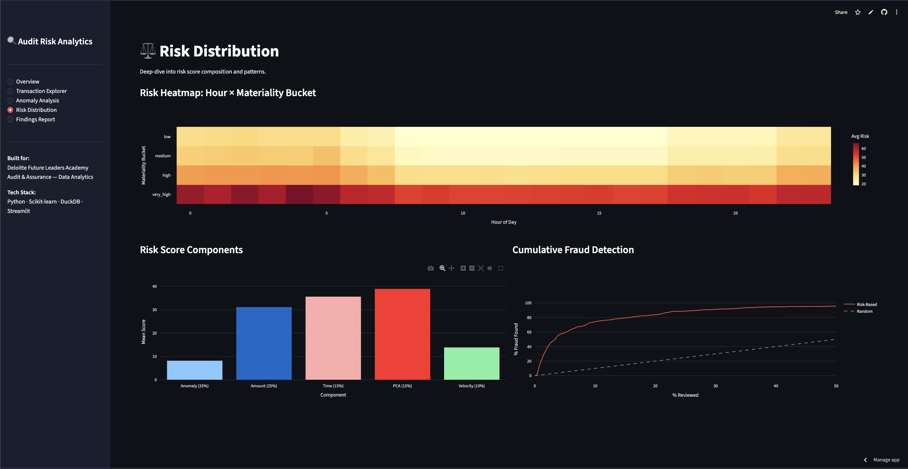
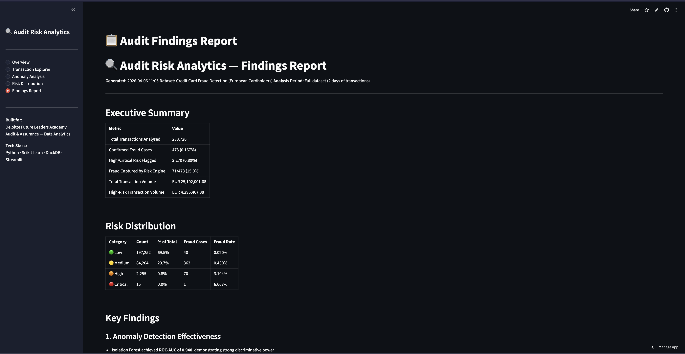

# Audit Risk Analytics

**[▶ Live Demo](https://audit-risk-analytics.streamlit.app)**

An end-to-end financial transaction analytics project that detects anomalies and scores risk across 284K credit card transactions. Built to simulate real audit analytics work — the kind of analysis a data analyst in an audit & assurance team would actually do.

## What it does

The project takes raw transaction data and runs it through a full pipeline:

1. **Cleans and transforms** the data (handles duplicates, normalises amounts, creates time features)
2. **Detects anomalies** using Isolation Forest and Local Outlier Factor
3. **Scores every transaction** on a 0-100 risk scale using five weighted factors
4. **Presents everything** in an interactive Streamlit dashboard with filterable views

The idea is straightforward: if you're auditing a company's transactions, you can't review all 284K of them manually. This system flags the ones worth looking at first.

## Screenshots

**Dashboard & Overview**
<p align="center">
  
  
</p>

**Transaction Explorer & Risk Distribution**
<p align="center">
  
  
</p>

**Audit Findings Report**
<p align="center">
  
</p>

## Key Results

- **Isolation Forest ROC-AUC: 0.948** — the model is genuinely good at separating fraud from legitimate transactions
- The risk scoring engine concentrates fraud where you'd expect: **6.67% fraud rate in "critical" vs 0.02% in "low"**
- Reviewing just the **top 5% of transactions by risk score** catches a disproportionate amount of fraud compared to random sampling
- 27 unit tests, all passing

## How it works

### Risk Scoring

Every transaction gets a composite risk score (0–100) based on:

| Factor | Weight | What it measures |
|---|---|---|
| Anomaly score | 35% | Output from Isolation Forest + LOF ensemble |
| Amount risk | 25% | How unusual the transaction amount is (z-score) |
| Time risk | 15% | Whether it happened during business hours or at 3am |
| PCA risk | 15% | How far the transaction sits from "normal" in feature space |
| Velocity risk | 10% | Whether the amount deviates from recent transaction patterns |

Transactions are then bucketed into four categories:

- 🟢 **Low** (0–25) — probably fine
- 🟡 **Medium** (26–50) — worth monitoring
- 🟠 **High** (51–75) — should be reviewed
- 🔴 **Critical** (76–100) — look at this immediately

### Project Structure

```
├── src/
│   ├── config.py                 # paths, thresholds, constants
│   ├── pipeline.py               # ETL: load → clean → transform → save
│   ├── feature_engineering.py    # rolling stats, PCA interactions, percentiles
│   ├── anomaly_model.py          # isolation forest + LOF + ensemble
│   ├── risk_scorer.py            # multi-factor risk scoring engine
│   └── report_generator.py      # auto-generates audit findings report
├── notebooks/
│   ├── 01_data_exploration.ipynb # EDA with 9 analysis sections
│   ├── 02_anomaly_detection.ipynb # model training and evaluation
│   └── 03_risk_scoring.ipynb     # risk engine analysis and validation
├── dashboard/
│   └── streamlit_app.py          # 5-page interactive dashboard
├── tests/                        # 27 unit tests
├── reports/                      # generated audit findings
├── Dockerfile
└── requirements.txt
```

## Getting Started

### Prerequisites
- Python 3.12+
- [uv](https://github.com/astral-sh/uv) (recommended) or pip

### Setup

```bash
# Clone
git clone https://github.com/EhtishamAziz01/audit-risk-analytics.git
cd audit-risk-analytics

# Create venv and install deps
uv venv --python 3.12 .venv
source .venv/bin/activate
uv pip install -r requirements.txt

# Download the dataset (you'll need a Kaggle account)
# Place creditcard.csv in data/raw/
# Or download from: https://www.kaggle.com/datasets/mlg-ulb/creditcardfraud
```

### Run the pipeline

```bash
# ETL pipeline — processes raw data into cleaned Parquet
python -m src.pipeline

# Launch the dashboard
streamlit run dashboard/streamlit_app.py
```

### Run with Docker

```bash
# Make sure data/processed/transactions_clean.parquet exists first
docker build -t audit-risk-analytics .
docker run -p 8501:8501 audit-risk-analytics
```

### Run Tests

```bash
python -m pytest tests/ -v
```

## Dataset

[Credit Card Fraud Detection](https://www.kaggle.com/datasets/mlg-ulb/creditcardfraud) — 284,807 transactions made by European cardholders in September 2013. Contains 30 features (28 PCA-transformed, plus Time and Amount) and a binary fraud label.

The dataset is intentionally imbalanced (0.17% fraud), which is realistic — in real audit work, anomalies are rare but high-impact.

## Tech Stack

- **Python 3.12** — core language
- **Pandas / NumPy** — data manipulation
- **Scikit-learn** — Isolation Forest, Local Outlier Factor
- **DuckDB** — fast SQL analytics
- **Streamlit** — interactive dashboard
- **Plotly / Matplotlib / Seaborn** — visualisations
- **Docker** — containerised deployment
- **pytest** — testing


## License

MIT
